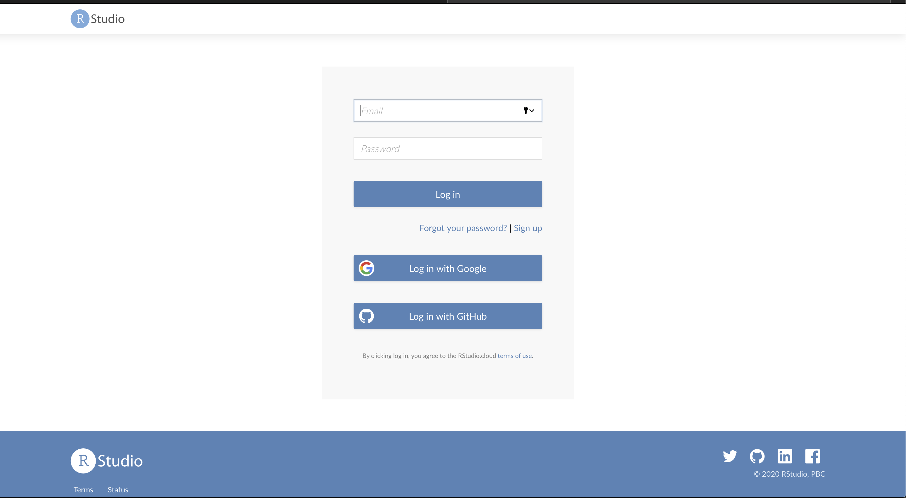
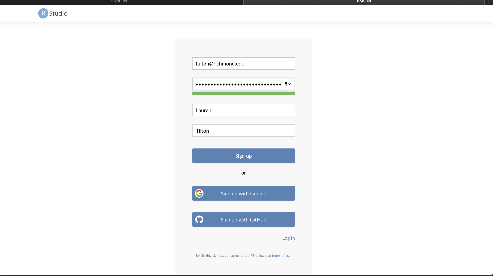
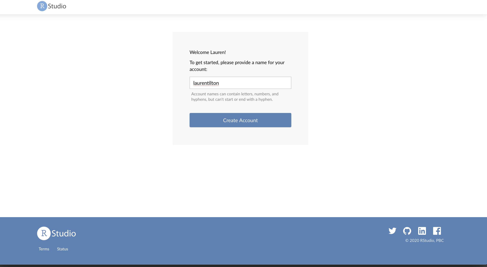
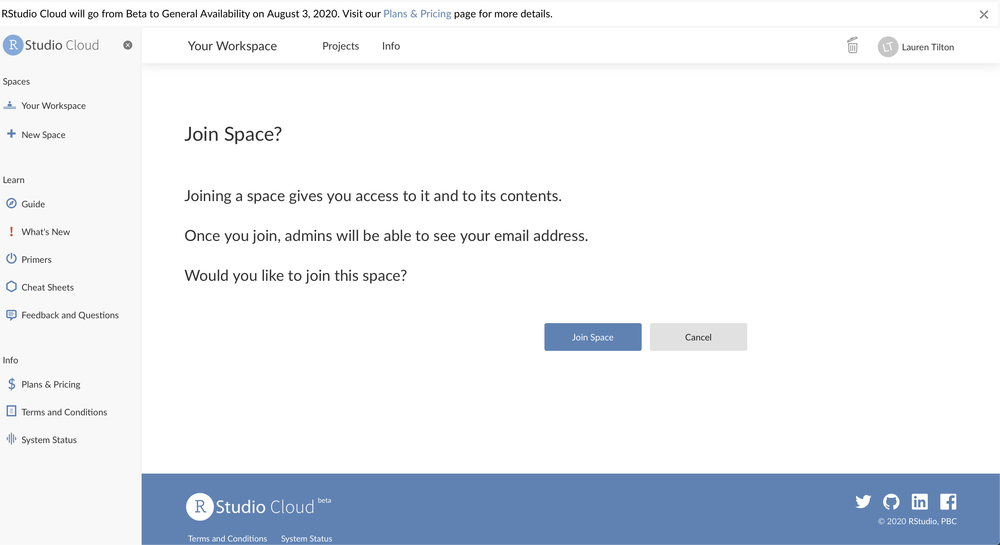
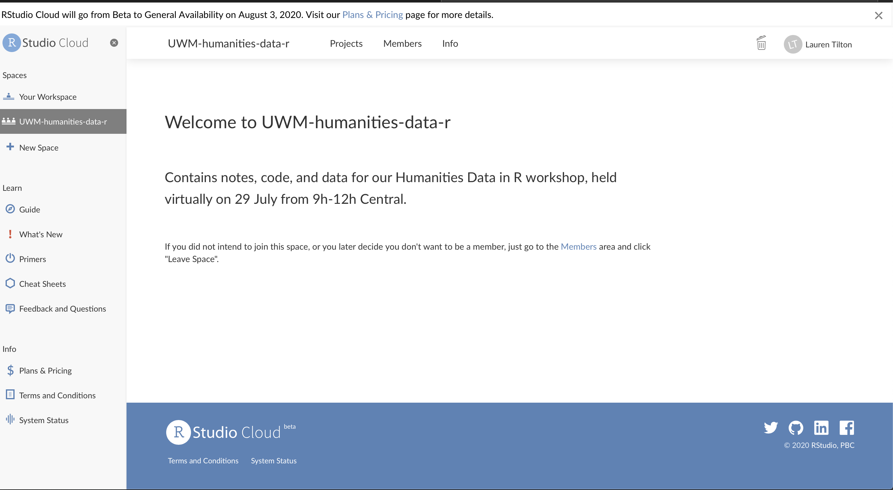

# Humanities Data in R Workshop – University of Wisconsin-Milwaukee Libraries

[Taylor Arnold](https://statsmaths.github.io), Assistant Professor of Statistics, [@statsmaths](https://twitter.com/statsmaths)

[Lauren Tilton](https://laurentilton.com), Assistant Professor of Digital Humanities, [@nolauren](https://twitter.com/nolauren)

This repository contains notes, code, and data for our Humanities Data in R
workshop, held virtually on 29 July from 9h-12h Central. A Zoom invitation for
the live workshop will be sent out as a seperate email. Feel free to use/share/adopt
these notes for other courses.

 This work is licensed under a <a rel="license" href="http://creativecommons.org/licenses/by/4.0/">Creative Commons Attribution 4.0 International License</a>.

---

## Code of Conduct

Our workshop is dedicated to providing a harassment-free experience
for everyone. We do not tolerate harassment of participants in any form.
If someone makes you or anyone else feel unsafe or unwelcome, please report it as
soon as possible. Harassment and other code of conduct violations reduce the value
of our event for everyone. We want you to be happy at our event. People like you
make our event a better place.

In order for this tutorial to be successful, we ask that participants take note
of the following guidelines throughout the session:

- This is an interactive workshop, and we expect everyone to, as best as possible,
follow along with the tutorial.
- At the same time, please stay at the same point with us in the tutorial. If you are
finished with a section ahead of time, you are more than welcome to hack away at our
code. We find that staying together through the tutorial works best for everyone
involved.

## Setup

In order to minimize setup issues during the remote workshop, we will be using
a hosted version of the R programming language called [RStudio Cloud](https://rstudio.cloud).
This service runs R in the browser and requires no local setup. All that is needed
is to create a free account using the instructions below. The service can be used
for 15 hours per month for free, after which additional computing time can be
purchased accorinding to several different plans. Alternatively, the 100% free and
open-source desktop version of R and RStudio may be used. It provides the exact same
functionality, but must be installed locally. Instructions for installing this version
are also provided below. We are happy to offer support for the Desktop installation process
asychronously before and after the workshop, but may not be able to directly help with
local issues during the workshop.

### RStudio RCloud (for the workshop itself)

If you are participating in the workshop, you should have received a link invitation to
join the project workspace. Click on the link to open the sign up page.

In order to setup RStudio RCloud, click on the link below to open a new window. You
will be prompted to create an account. You should be welcomed by a page that looks like
this:

  

Click on the sign-up button and create an account.

  

Pick a username:

  

And join the UWM-humanities-data-r workspace by clicking on the 'Join' button:

  

This should bring you to the following page, at which point you are finished:

  

You should get an email asking you to confirm your email address, which you should make sure
to do within the next 48 hours. And that's it! Just be ready to log back into RStudio with
your email and password on the day of the workshop. If you run into issues, please contact
the workshop leaders ahead of time and we will be happy to help.

### RStudio Desktop (recommended for future work)

In order to install the course materials locally on your computer, you will need to
install three components. Links for this are given below; if you are not familiar with
installing programming components on your local machine, we suggest waiting until
after the workshop to follow these steps.

- [R Programming language](https://www.r-project.org/)
- [RStudio](https://rstudio.com/products/rstudio/download/#download)
- course notebooks and datasets: click the green "Clone" button below and unzip the file

## Schedule

This workshop will focus on giving an overview of how R can be used to perform a variety
of data analysis tasks relevant in the Humanities. Due to the short duration of the workshop,
we will focus on the showcasing the possibilities or using R. With this in mind, the
workshop will (tentatively) be organized as follows:

- **(09:00-09:10)** Introductions and Setup (Notebook01)
- **(09:10-10:00)** Data Visualization (Notebook02)
- **(10:00-10:10)** *break*
- **(10:10-10:40)** Textual Analysis (Notebook03)
- **(10:40-11:20)** Network Analysis (Notebook04)
- **(11:20-11:30)** *break*
- **(11:30-12:00)** Spatial Analysis and Wrap-up (Notebook05)

We will be available after the workshop to assist participants looking to see how to extend
the materials to their own datasets.

## References

Below are several links to follow-up on the topic covered in the workshop. All of these are
freely available online.

- Arnold, Taylor, and Lauren Tilton. "Basic Test Processing in R". *Programming Historian*.
[link](https://programminghistorian.org/en/lessons/basic-text-processing-in-r)
- Wickham, Hadley, and Garrett Grolemund. *R for Data Science*.
[link](https://r4ds.had.co.nz)
- Data Carpentry. "R for Social Scientists" [link](https://datacarpentry.org/r-socialsci/)
- Arnold, Taylor. *Exploratory Data Science*. **work in progress**
[link](https://statsmaths.github.io/eds_book/index.html)
